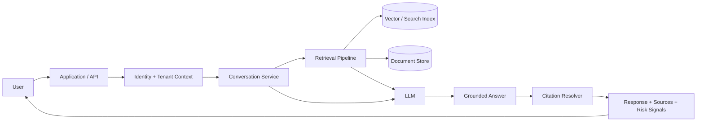
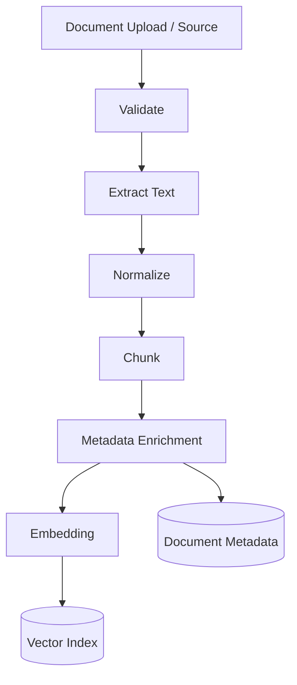
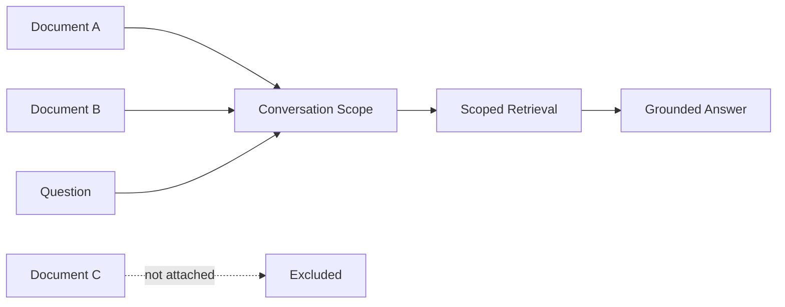
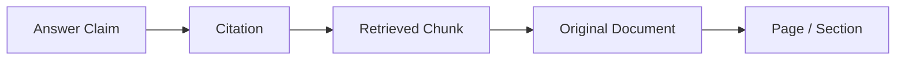

# SAEI Engineering

> Engineering case study of a multi-tenant legal AI platform built around retrieval-augmented generation, document intelligence, source-grounded answers, and risk-oriented analysis.

SAEI was designed for a domain where a fluent answer is not enough. Legal information needs context, traceability, source grounding, document-level permissions, and clear separation between retrieved evidence and generated interpretation.

I worked on the architecture and implementation across the RAG, document, conversation, citation, risk-analysis, and multi-tenant layers.

This repository explains the engineering approach without publishing private source code, legal corpora, customer documents, prompts, credentials, or proprietary product logic.

---

## The problem

A conventional chatbot can generate plausible text from its model knowledge.

A legal-information system needs a stronger pipeline:

```text
Question
   ↓
Who is asking?
   ↓
Which workspace / documents can they access?
   ↓
What legal material is relevant?
   ↓
Which passages support the answer?
   ↓
What can safely be concluded from those passages?
   ↓
How can the user inspect the evidence?
```

That changes the role of the LLM.

The model is not the source of truth. It is a reasoning and language layer operating over **retrieved, permission-aware evidence**.

## System overview



The core architectural rule is:

**retrieval and authorization happen before evidence is exposed to the generation layer.**

## Document ingestion

Documents need to become searchable without losing their identity.

A simplified ingestion pipeline is:



The index should not contain anonymous text fragments.

Each chunk needs enough metadata to trace it back to its source, for example:

```ts
type LegalChunk = {
  id: string;
  tenantId: string;
  documentId: string;
  text: string;
  page?: number;
  section?: string;
  chunkIndex: number;
  sourceType?: string;
};
```

This metadata is important for both security and citation generation.

## Chunking

Chunking is not simply splitting every N characters.

Legal documents have useful structure:

- articles
- sections
- clauses
- headings
- numbered provisions
- pages
- definitions

A chunk that destroys these relationships may embed well enough to be searchable but still provide poor evidence to the model.

Conceptually:

```text
document structure
      +
target chunk size
      +
overlap / continuity
      +
citation boundaries
      ↓
retrievable legal chunks
```

The right strategy balances semantic completeness against retrieval precision and context-window cost.

## Retrieval

At query time, SAEI needs to find evidence that is both **relevant** and **authorized**.

```python
context = resolve_tenant_and_user(request)

query = prepare_query(user_question)

candidates = search(
    query=query,
    tenant_id=context.tenant_id,
    accessible_documents=context.document_scope
)

evidence = rank_and_filter(candidates)

answer = generate(question=user_question, evidence=evidence)
```

The important property is that access filtering is part of retrieval, not an afterthought applied after sensitive text has already been passed to the model.

## Tenant isolation

A multi-tenant legal platform can contain highly sensitive documents.

Every major resource should carry tenant ownership:

```text
Tenant
├── Users / Memberships
├── Documents
│   └── Chunks / embeddings
├── Conversations
│   └── Messages
└── Analysis / derived results
```

A vector search that ignores tenant boundaries is effectively a data leak even if the main relational database is correctly isolated.

Tenant filtering therefore needs to apply consistently across:

- relational queries
- document storage
- vector retrieval
- conversations
- citations
- generated artifacts
- caches

## Attach documents to a conversation

A useful legal workflow may require the user to narrow a conversation to specific uploaded material.



This creates a second retrieval boundary beneath the tenant boundary.

The system can therefore reason about:

```text
documents tenant may access
          ∩
documents attached to conversation
          =
documents eligible for retrieval
```

## Source-grounded generation

The prompt should make a distinction between:

1. user question
2. retrieved evidence
3. system instructions
4. conversation history

A simplified flow is:

```text
question
   ↓
retrieve evidence
   ↓
construct grounded context
   ↓
LLM synthesis
   ↓
structured answer
   ↓
citation verification / mapping
```

The model should be encouraged to acknowledge insufficient evidence instead of filling gaps with unsupported certainty.

## Citations

A citation is not merely a footnote added after generation.

The application needs a reliable relationship between claims and retrieved source material.

A citation object can conceptually contain:

```ts
type Citation = {
  documentId: string;
  chunkId: string;
  page?: number;
  section?: string;
  excerpt?: string;
};
```

The UI can then let the user move from an answer back to the relevant source.



This makes the output inspectable rather than requiring the user to trust generated prose.

## Retrieval quality

RAG quality depends on more than the embedding model.

Failure can happen at several stages:

```text
bad extraction
    ↓
bad chunks
    ↓
weak metadata
    ↓
poor retrieval
    ↓
irrelevant context
    ↓
poor answer
```

This is why evaluating only the final LLM response can hide the real cause of an error.

Useful retrieval signals can include:

- semantic similarity
- keyword/lexical relevance
- document metadata
- conversation scope
- jurisdiction/source filters
- reranking
- duplicate suppression

## Risk-oriented analysis

SAEI can associate analysis with risk-oriented labels or signals.

The important architectural distinction is that a risk label should be treated as **derived analysis**, not an immutable property of a document.

```text
source material
      +
retrieved context
      +
analysis criteria
      ↓
structured risk analysis
      ↓
label + reasoning + evidence
```

A structured output is preferable to extracting meaning from arbitrary prose:

```ts
type RiskAnalysis = {
  level: string;
  rationale: string;
  citations: Citation[];
  limitations?: string[];
};
```

This allows the interface to present the conclusion together with supporting evidence and uncertainty.

## Conversation architecture

Legal conversations may accumulate significant context.

Sending the entire conversation plus every attached document to the model on every request is neither efficient nor necessarily useful.

A better conceptual model separates:

```text
recent conversation context
        +
retrieved legal evidence
        +
relevant document scope
        +
system / product instructions
        ↓
model context
```

Retrieval becomes part of context management rather than a one-time preprocessing step.

## Hallucination boundaries

RAG reduces unsupported generation but does not eliminate it.

A production system should therefore design for uncertainty.

Useful safeguards include:

- require source-grounded responses where appropriate
- expose citations
- constrain retrieval to authorized sources
- instruct the model not to invent missing provisions
- represent insufficient evidence explicitly
- keep deterministic metadata outside generated prose
- log retrieval and model traces for debugging

The goal is not to pretend the model cannot be wrong. The goal is to make the system **more inspectable when it is**.

## Technology & engineering areas

| Area | Focus |
| --- | --- |
| Product | Multi-tenant legal AI |
| AI | LLM-based analysis and synthesis |
| Retrieval | RAG, semantic search, metadata filtering |
| Documents | ingestion, extraction, chunking, attachments |
| Search | vector retrieval and relevance ranking |
| Trust | citations and source traceability |
| Security | tenant/document isolation |
| Analysis | structured risk-oriented outputs |
| Application | conversational document intelligence |

## Engineering challenges

### Retrieval is a security boundary

Correct SQL tenant isolation is not enough if the vector store can retrieve another tenant's chunks.

### Citations need stable provenance

Chunks must retain a durable relationship with the original document, page, and section.

### Legal structure affects chunk quality

Arbitrary token windows can split provisions in ways that reduce retrieval usefulness.

### More context is not always better

Passing many weakly relevant chunks can make generation worse while increasing latency and cost.

### Generated confidence is not evidence

The system needs to expose source material and limitations rather than using fluent language as a proxy for correctness.

## What I worked on

My work on SAEI included engineering across:

- multi-tenant legal AI architecture
- document ingestion and processing
- retrieval-augmented generation
- semantic/vector search
- document-aware conversations
- attaching documents to chats
- tenant- and document-scoped retrieval
- source citations and provenance
- structured risk labels / analysis
- prompt/context architecture
- safeguards around source-grounded generation

## Why this repository exists

The SAEI production application and legal data are private.

This repository documents the engineering architecture using generalized examples. It intentionally excludes production source code, customer documents, legal datasets, credentials, private prompts, proprietary ranking logic, and confidential business information.

---

This is an engineering case study, not a legal-information source or legal advice.
