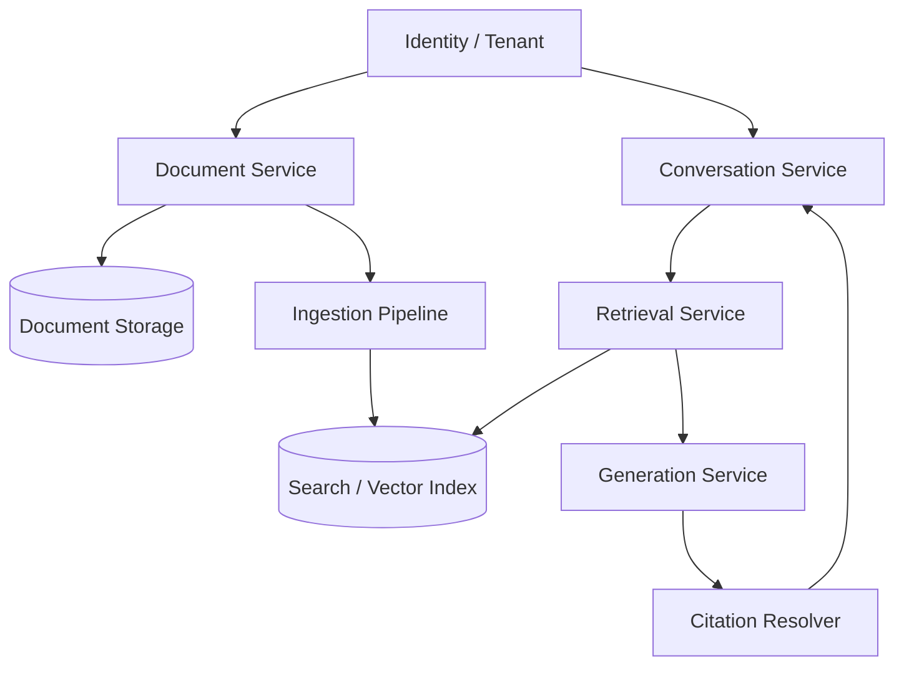

# Architecture Notes

## Main boundaries



### Document service

Owns document identity, metadata, permissions, storage references, and lifecycle.

### Ingestion pipeline

Transforms supported source material into searchable chunks while preserving provenance.

### Retrieval service

Accepts a query plus authorization/document scope and returns ranked evidence.

### Generation service

Synthesizes responses from explicit evidence and conversation context.

### Citation resolver

Maps generated/source references back to stable document metadata suitable for presentation.

## Derived data

Embeddings, chunks, summaries, and risk analyses should be treated as derived data.

The original document remains the authoritative source.

This distinction helps when:

- re-chunking documents
- changing embedding models
- rebuilding indexes
- changing analysis prompts
- invalidating stale derived results

## Observability

Debugging RAG requires visibility into more than the final answer.

Useful trace information includes:

```text
query
retrieval filters
candidate chunks
ranking / scores
selected evidence
model request metadata
citation mapping
latency by stage
```

Sensitive text should be handled according to the product's privacy requirements; observability should not become a second uncontrolled copy of customer data.
